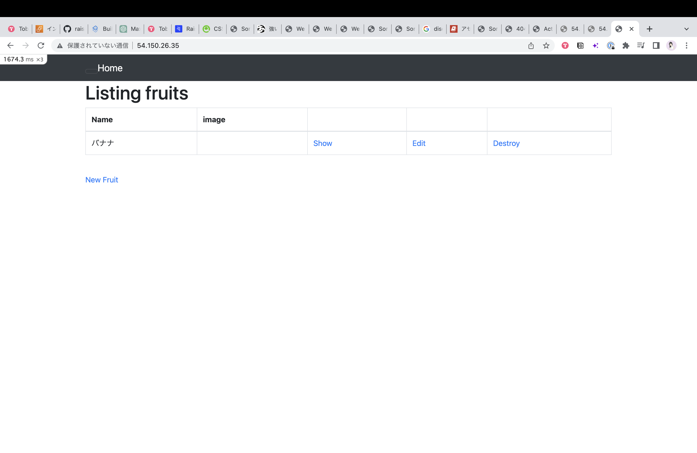
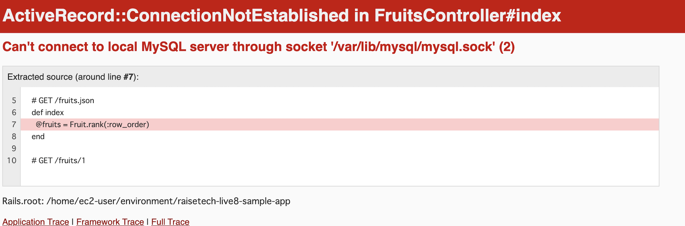
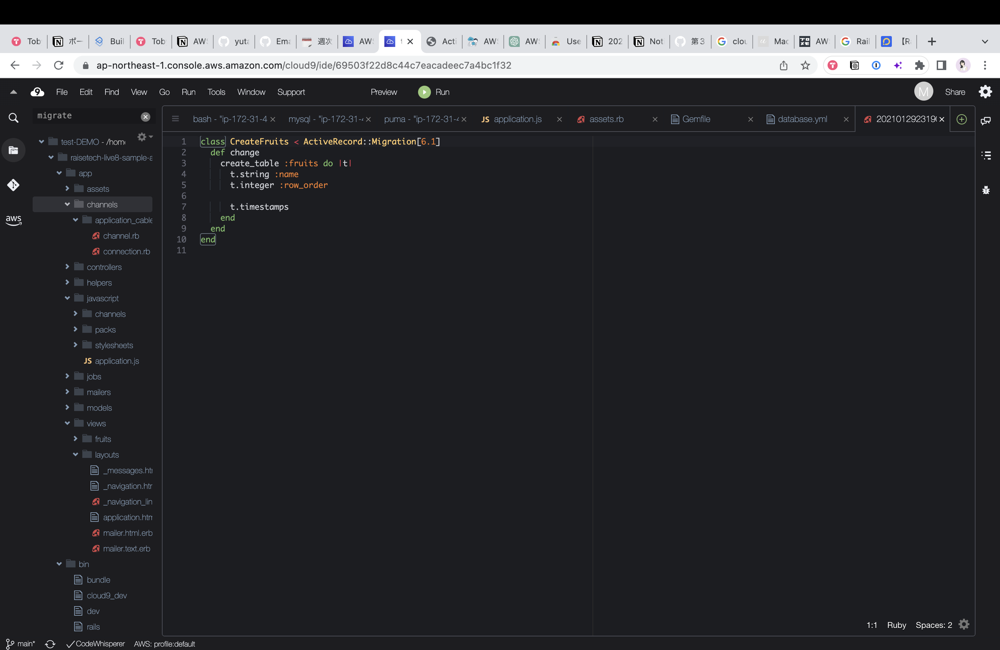

#学習したこと
***
1. APIサーバーについて
Pumaを使用。バージョン5.6.5

2. APサーバーを終了させた時
エラーが表示されます。

3. DBサーバーについて
MySQL使用　　バージョン8.0.33

4. DBサーバー終了させた時
エラーが出ます

5. Railsの構成管理ツール
Active Record Migrations（アクティブレコードマイグレーション）

***
##難しかったです.もっと復習頑張ります.
