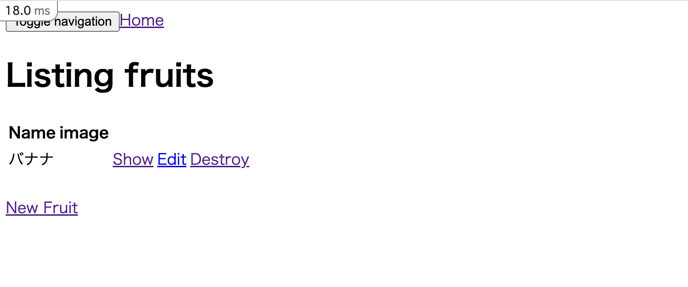
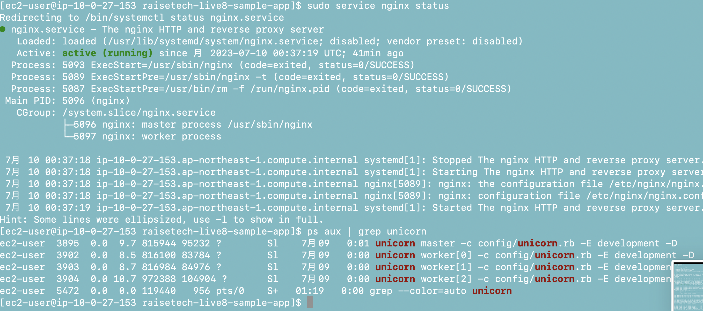
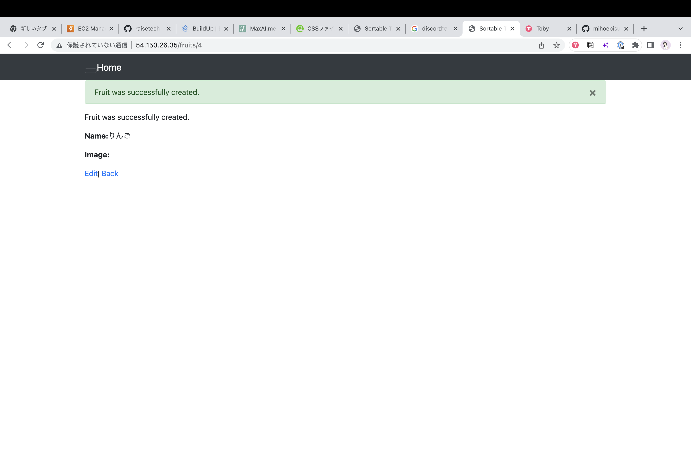
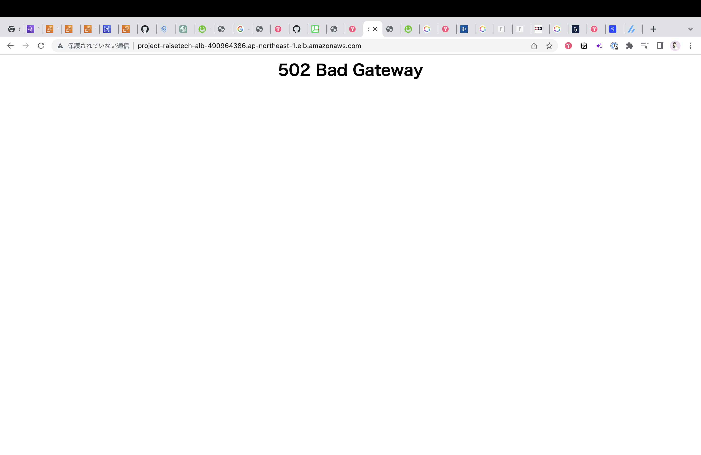
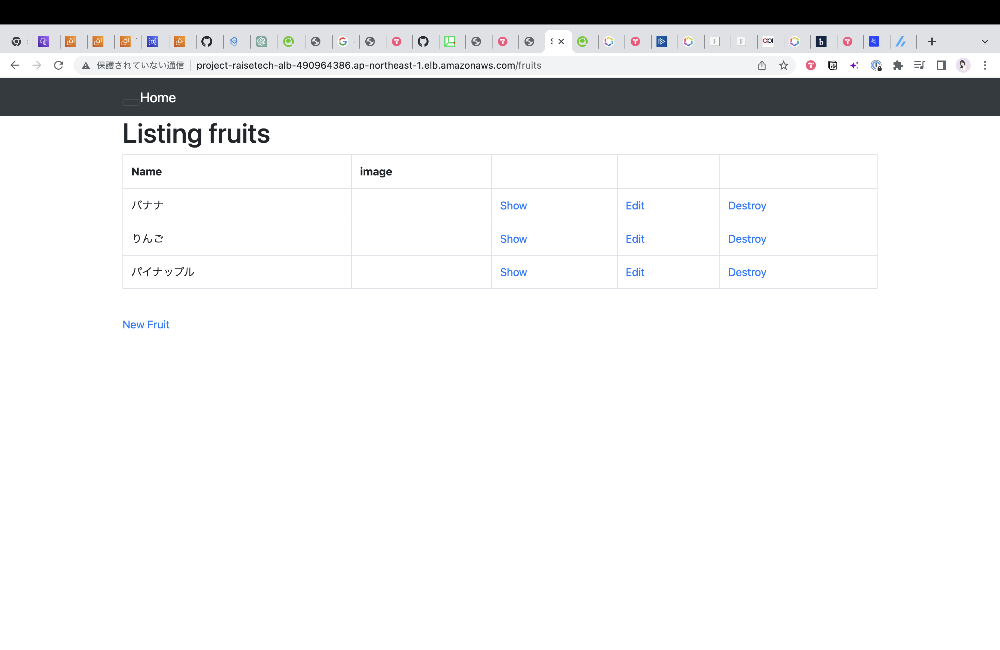
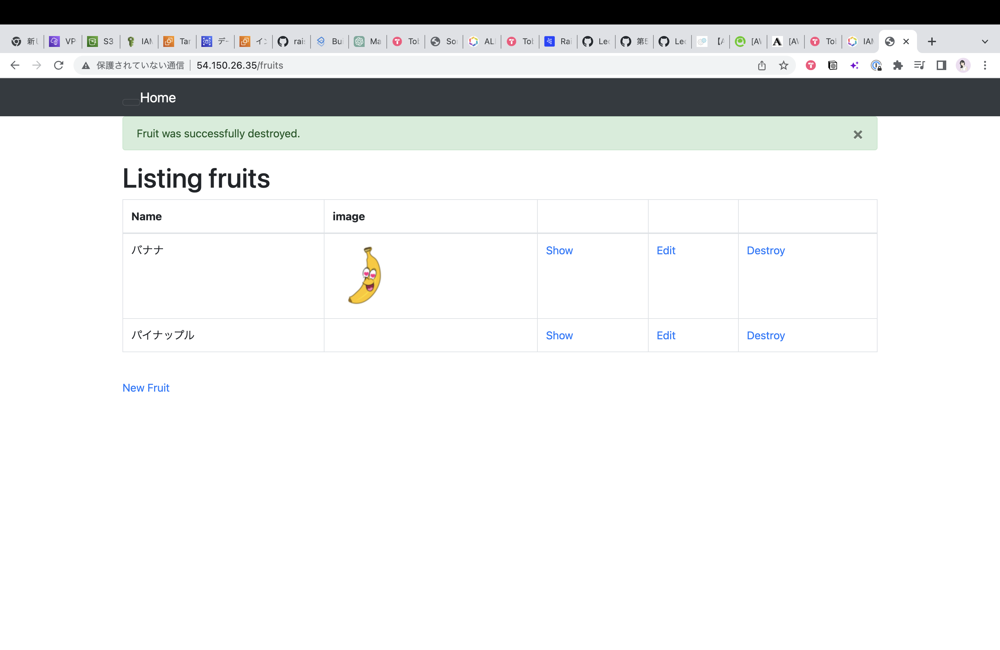
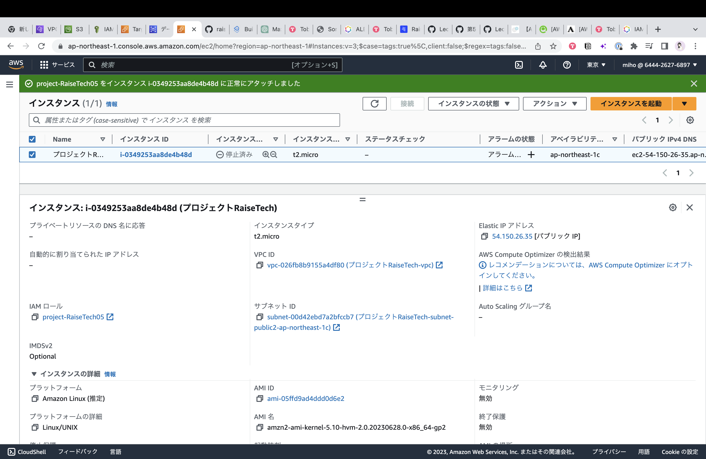
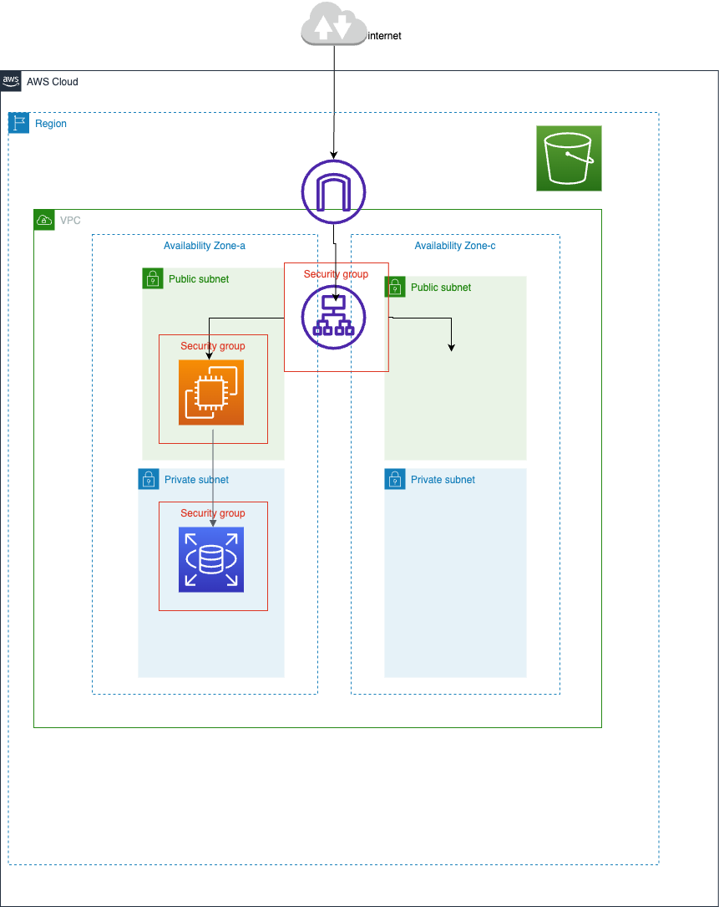

# 第５回課題報告

## 1. 組み込みサーバーのみで起動

pumaで起動　

## 2. Unicorn Nginxで起動

このレイアウト崩れがなかなか解消できずに苦労しました。cssのデバックがでないようにNginxの設定ファイルを変更したら解消できました！

## 3. ALB追加

最初ヘルスチェックが通らなかったですが、ポート番号間違えてました。

## 4. S3を追加

ファイルをアップロードしました

IAMロールを割り当てました

## 5. 構成図

